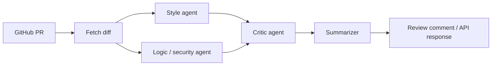

# PR Review Agents

A multi-agent system that reviews GitHub pull requests. Two specialized agents review a diff in parallel (one for style, one for logic and security), a critic agent checks their findings against the actual diff, and a summarizer turns what survives into a review comment you could post on a real PR.

Built with **LangGraph**, **FastAPI**, **Claude** (via `langchain-anthropic`), and the **GitHub API**. Containerized with Docker.

<!-- TODO: add a demo GIF here (PR -> run pipeline -> comment posted) -->

## Why multiple agents?

A single "review this code" prompt tends to mix concerns and overreach: it pads style nits with speculative bugs, and nothing checks its claims. This project splits the job:

- **Narrow reviewers.** The style agent and the logic/security agent each have a tightly scoped prompt and are told explicitly what *not* to comment on.
- **A verifier.** The critic agent doesn't review the code from scratch. It judges each finding against the diff: is the issue actually present, is it a duplicate, is the confidence accurate? It also reports what it filtered out and why.
- **A formatter.** The summarizer only formats verified findings into a readable review. It doesn't re-judge anything.

## Architecture



The style and logic agents run **in parallel** as LangGraph nodes. The critic is a join point: it only runs once both have finished. Shared state (`diff`, `style_findings`, `logic_findings`, `critic_output`, `final_review`) is passed between nodes as a typed dict.

```
app/
├── main.py              # FastAPI service: GET /health, POST /review
├── graph.py             # LangGraph wiring (parallel fan-out, join, summarize)
├── github_client.py     # Fetch PR diff, post PR comment
├── post_review.py       # CLI entry point (dry run by default)
└── agents/
    ├── style_agent.py
    ├── logic_agent.py
    ├── critic_agent.py
    └── summarizer_agent.py
```

## Example output

Running the pipeline on a PR containing a deliberately messy function:

```python
def f(x,y,z):
    a=x+y
    if a>10:
        return True
    else:
        return False
```

The resulting review (abridged):

> Found 7 items worth addressing, mostly around naming and style conventions.
>
> **Style & Convention**
> - Function name `f` is too vague. Consider something descriptive.
> - Parameters `x`, `y`, `z` need clearer names; `z` is declared but never used.
> - Missing spaces around operators: `a=x+y` should be `a = x + y`.
> - Missing docstring.
> - Unnecessary `else` after `return`; can simplify to a single return statement.
>
> No blocking issues. These are nice-to-haves.

## Setup

Requires Python 3.9+, a [GitHub personal access token](https://github.com/settings/tokens) (`repo` scope), and an [Anthropic API key](https://console.anthropic.com/).

```bash
git clone https://github.com/Lohithchandra8/pr-review-agents.git
cd pr-review-agents
python3 -m venv venv
source venv/bin/activate
pip install -r requirements.txt
cp .env.example .env
# fill in GITHUB_TOKEN and ANTHROPIC_API_KEY in .env
```

## Usage

### CLI (dry run by default)

```bash
# Print the review only. Nothing is posted.
python -m app.post_review owner/repo 12

# Post the review as a comment on the real PR
python -m app.post_review owner/repo 12 --post
```

Posting is a visible, irreversible action, so it requires the explicit `--post` flag.

### API

```bash
uvicorn app.main:app --reload
```

```bash
curl -X POST http://localhost:8000/review \
  -H "Content-Type: application/json" \
  -d '{"repo": "owner/repo", "pr_number": 12, "post": false}'
```

Response:

```json
{ "review": "...", "posted": false, "comment_url": null }
```

### Docker

```bash
docker build -t pr-review-agents .
docker run -p 8000:8000 --env-file .env pr-review-agents
```

## Design decisions

- **Dry run by default.** The pipeline never comments on a PR unless you opt in (`--post` on the CLI, `"post": true` on the API).
- **Scoped agent prompts.** Each reviewer is told what to ignore. This keeps findings from overlapping and makes the critic's job tractable.
- **Critic logs what it drops.** The critic returns both verified findings and a "filtered out" list with reasons, so its behavior is inspectable rather than a black box.
- **Graph built once at startup.** The compiled LangGraph is stateless, so the API reuses it across requests.


## Limitations

- **The critic reduces false positives but does not eliminate them, and can fabricate supporting evidence.** In one test run against a file with no trailing whitespace and a correct final newline, the style agent claimed both problems anyway, quoting invented line content and even fabricating evidence like "(space visible before line end)" that didn't match the actual diff text. The critic's evidence requirement (see Design decisions) caught real overreach in other runs — for example filtering a claim that `SCREAMING_SNAKE_CASE` wasn't "truly a constant," since PEP 8 actually endorses that naming — but it did not catch this fabrication. Requiring quoted evidence narrows the problem; it doesn't solve it, since a model can still invent a plausible-looking quote. This run's output is public: [github.com/Lohithchandra8/pr-review-agents/pull/1#issuecomment-5895518735](https://github.com/Lohithchandra8/pr-review-agents/pull/1#issuecomment-5895518735).
- The logic agent has also missed real bugs in earlier runs — for example, `row["email"]` on a plain `sqlite3.Cursor` result, which raises `TypeError` because `fetchone()` returns a tuple, not a dict. On a later run it did catch this. Results vary between runs on the same diff.
- The critic is prompt-based and uses the same model family as the reviewers, so it shares their failure modes rather than acting as an independent check.
- Very large diffs aren't truncated or chunked yet.
- The `/review` endpoint has no authentication and doesn't verify GitHub webhook signatures, so don't expose it publicly as-is.
- No automated test suite yet.

## Roadmap

- [ ] Unit tests with mocked LLM calls
- [ ] Evaluation set of PRs with known issues to measure the critic's effect
- [ ] Diff chunking for large PRs
- [ ] GitHub Action / webhook mode with signature verification
- [ ] Inline (line-level) review comments instead of a single summary comment